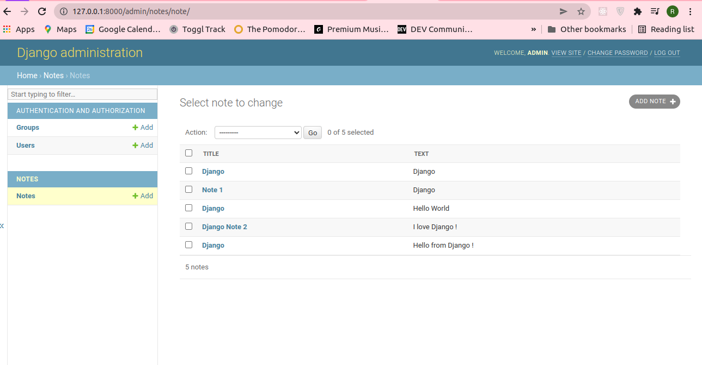

# Access Notes

## Introduction

Access Notes is web application based on Django that allows the user to view/add/update/delete notes.
The user can perform CRUD operations in the browser, Django Admin and a Restful API.




## Dependencies

### 1. Backend Dependencies

The backend of the project includes:

- **virtualenv** as a tool to create isolated an Python environment
- **Postgres** as our database of choice
- **Python 3** and **Django** as our server language and server framework

You can download and install the dependencies mentioned above using these `virtualenv`:

```
pip3 install virtualenv
virtualenv venv
source venv/bin/activate
pip3 install -r requirements.txt 
```

### 2. Frontend Dependencies

We use HTML, CSS, and Bootstrap for our front end


## Development Setup

```
git clone https://github.com/rawda-developer/Access_Notes
cd Access_Notes
```

**Run the development server:**

```
    cd Access_Notes
    ./manage.py makemigrations
    ./manage.py migrate
    ./manage.py createsuperuser
    ./manage.py test
    ./manage.py runserver
```

## Verify on the Browser<br>
Navigate to project homepage [http://127.0.0.1:8000/](http://127.0.0.1:8000/) or [http://localhost:8000](http://localhost:8000)
<br><br>

## Verify admin<br>
Navigate to Admin[http://127.0.0.1:8000/admin](http://127.0.0.1:8000/admin) or [http://localhost:8000/admin](http://localhost:8000/admin)

<br>

## Verify RESTful API<br>

### View all note<br> 
[http://127.0.0.1:8000/api/v1/notes/all/](http://127.0.0.1:8000/api/v1/notes/all/) or [http://localhost:8000/api/v1/notes/all/](http://localhost:8000/api/v1/notes/all/)
<br>

### Retrieve/Update/Delete a Note<br> 
[http://127.0.0.1:8000/api/v1/notes/6/](http://127.0.0.1:8000/api/v1/6/) or [http://localhost:8000/api/v1/notes/6/](http://localhost:8000/api/v1/notes/6/)

<br>

### Create a new Note<br>
[http://127.0.0.1:8000/api/v1/notes/new/](http://127.0.0.1:8000/api/v1/new/) or [http://localhost:8000/api/v1/notes/new/](http://localhost:8000/api/v1/notes/new/)